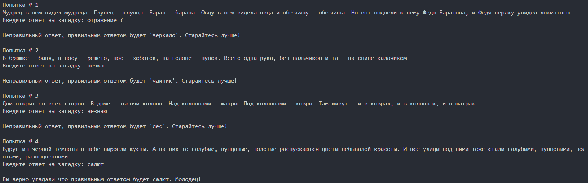
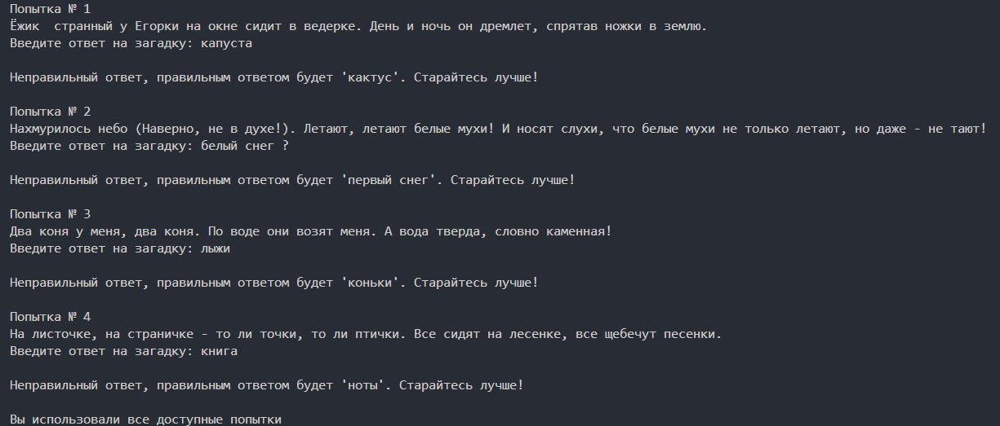
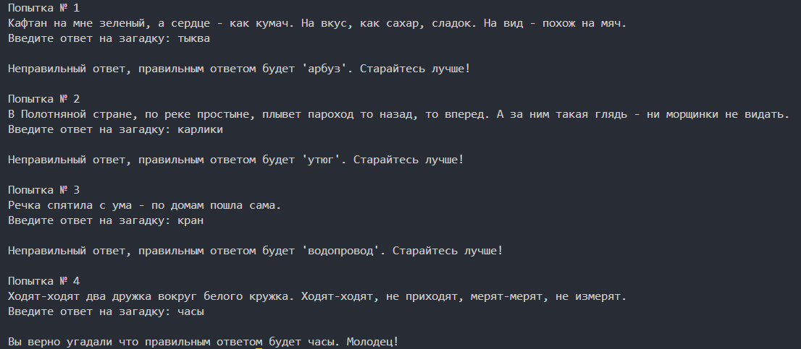
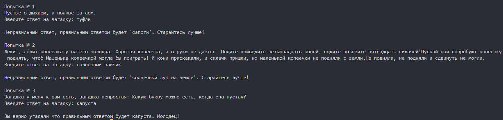

# 🤓 Угадай Загадку

Простая консольная игра на Python, где нужно угадывать загадки.

## 📖 Оглавление
- [Возможности](#возможности)
- [Примеры использования](#примеры-использования)
- [Ограничения](#ограничения)
- [Установка](#установка)
- [Скриншоты](#скриншоты)
- [Лицензия](#лизензия)

## 🎉 Возможности
- ✅ Могут попадаться как и сложные так и легкие загадки
- ✅ Число попыток ограничено (по умолчанию равно 4)
- ✅ Загадки появляются случайным образом

## 💡 Примеры использования
```
Попытка № 1
Ходят-ходят два дружка вокруг белого кружка. Ходят-ходят, не приходят, мерят-мерят, не измерят.
Введите ответ на загадку: часы

Вы верно угадали что правильным ответом будут часы. Молодец!


Попытка № 1
Ах, не трогайте меня: Обожгу и без огня!
Введите ответ на загадку: горячий чайник ?

Неправильный ответ, правильным ответом будет 'крапива'. Старайтесь лучше!

Попытка № 2
В брюшке - баня, в носу - решето, нос - хоботок, на голове - пупок. Всего одна рука, без пальчиков и та - на спине калачиком
Введите ответ на загадку: чайник

Вы верно угадали что правильным ответом будет чайник. Молодец!
```

## 🏴‍☠️ Ограничения
- ❌ Число загадок конечно
- ❌ Загадки могут повторяться

## 🛠️ Установка и запуск

### Версия 1.0 (Историческая)
```bash
cd old_version
python riddle_game_old.py
```

### Версия 2.0 (Рекомендуется)
```bash
cd refactored
python riddle_game.py
```

## 📸 Скриншоты





## 📂 Структура проекта
```
riddle-game/
/---old_version/          # Монолитная версия
/   /---riddle_game_old.py
/---refactored/           # Модульная версия
/   /---riddle_game.py
/   /---game_logic.py
/---images/               # Скриншоты
/   /---image_001.png
/   /---image_002.png
/   /---image_003.png
/   /---image_004.png
/---README.md
/---.gitignore
```

## 🔄️ История изменений
- **v2.0** - Модульная архитектура, улучшенная обработка ошибок
- **v1.0** - Первоначальная монолитная версия

## 📄 Лизензия

Этот проект распространяется под **лизензией MIT** - одной из самых разрешительных open-source лицензий.

### Файлы лицензии:
- **[LICENSE](LICENSE)** - оригинальная версия на английском языке (имеет юридическую силу)
- **[LICENSE.ru](LICENSE.ru)** - перевод на русский язык (для удобства ознакомления)

### Что это значит:
- ✅ Вы можете свободно использовать, модифицировать и распространять код
- ✅ Можно использовать в коммерческих проектах
- ✅ Обязательное условие: указание авторства
- ❌ Автор не несет ответственности за возможные проблемы

*Для юридических целей следует руководствоваться английской версией лицензии.*